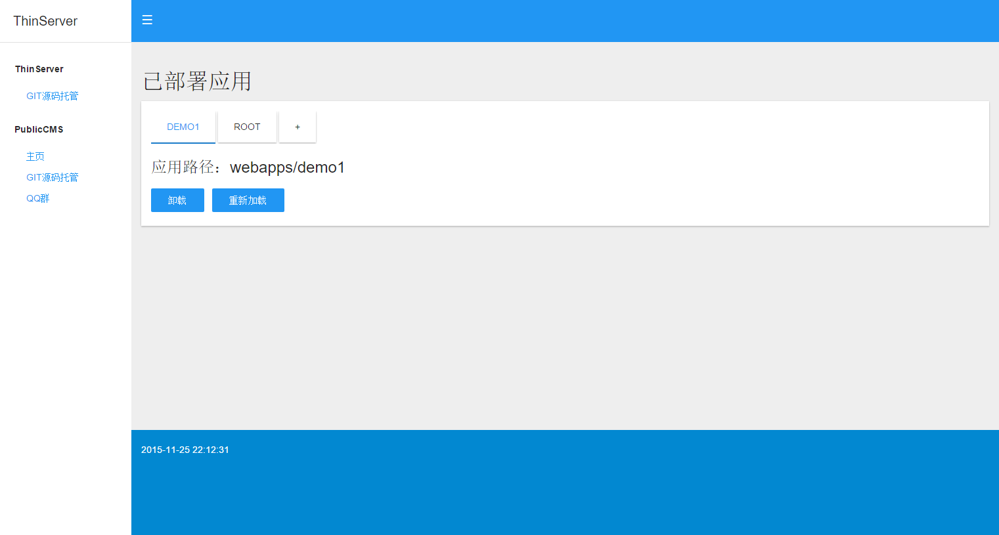

#ThinServer

##简介
ThinServer是基于JDK提供的HttpServer开发的Web服务容器，体积小，主程序jar包只有24k。应用开发简单只需要实现com.sanluan.server.application.ThinInitializer，com.sanluan.server.servlet.ThinServlet接口即可

执行bin/start.bat启动容器，执行bin/stop.bat停止程序。http服务默认端口：80；socket控制管理端口：8010

功能在不断完善中，有兴趣的朋友可以加群交流。QQ群为另一个产品PublicCMS的交流群。

##授权
该软件永久开源免费(MIT 授权协议)

