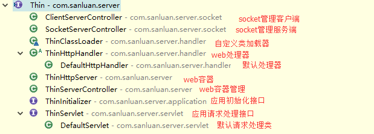

#ThinServer

##特性

* 瘦
* 应用热部署
* Socket管理应用
* 自定义Handler

##简介
ThinServer是基于JDK提供的HttpServer开发的Web服务容器，体积小，出去使用的apache commons logging组件，主程序jar包只有23k。应用开发简单只需要实现com.sanluan.server.application.ThinInitializer，com.sanluan.server.servlet.ThinServlet即可

##授权
该软件永久开源免费(MIT 授权协议)

