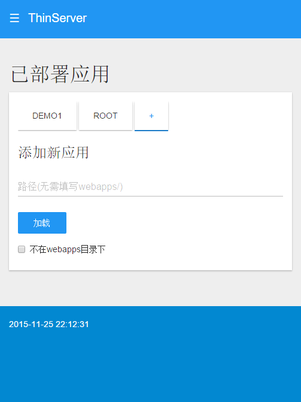

#ThinServer

##简介
ThinServer是基于JDK提供的HttpServer开发的Web服务容器，体积小，主程序jar包只有24k。应用开发简单只需要实现com.sanluan.server.application.ThinInitializer，com.sanluan.server.servlet.ThinServlet接口即可

提供windows，linux启动、停止脚本。执行bin/start启动容器，执行bin/stop停止程序。http服务默认端口：80；socket控制管理端口：8010，如果需要修改，请在脚本中添加参数

-Dcom.sanluan.server.ThinHttpServer.port=http端口

-Dcom.sanluan.server.ThinHttpServer.controlPort=控制端口

conf/load文件中可以配置默认加载的应用，grant 应用名 为授权该应用可以控制整个容器

默认的Servlet实现已经支持普通html文件等的http服务。所以这个容器也可以用来将某个目录发布为web站点。

    代码中附带三个例子分别是ROOT（容器管理应用），demo1（FreeMarker实现动态示例），gpio4pi（通过遥控或网页控制4路开关示例）

    gpio4pi的硬件设备与线路实现参考：http://www.publiccms.com/2015/11/05/709.html

功能在不断完善中，有兴趣的朋友可以加群交流。QQ群为另一个产品PublicCMS的交流群。

##授权
该软件永久开源免费(MIT 授权协议)

